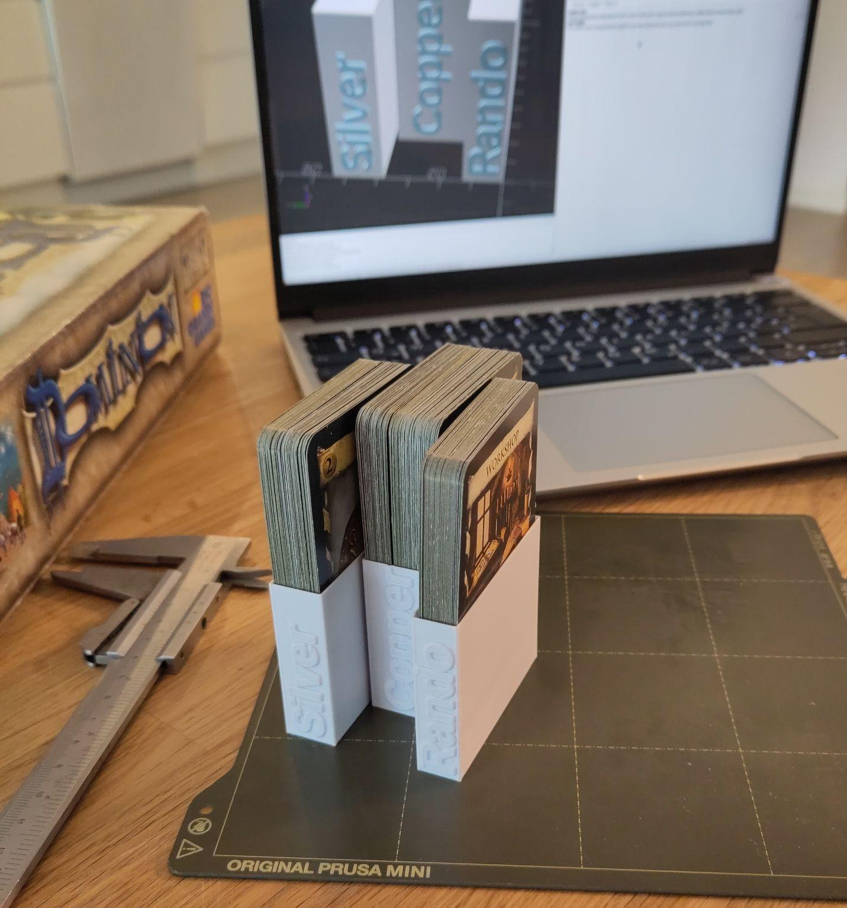
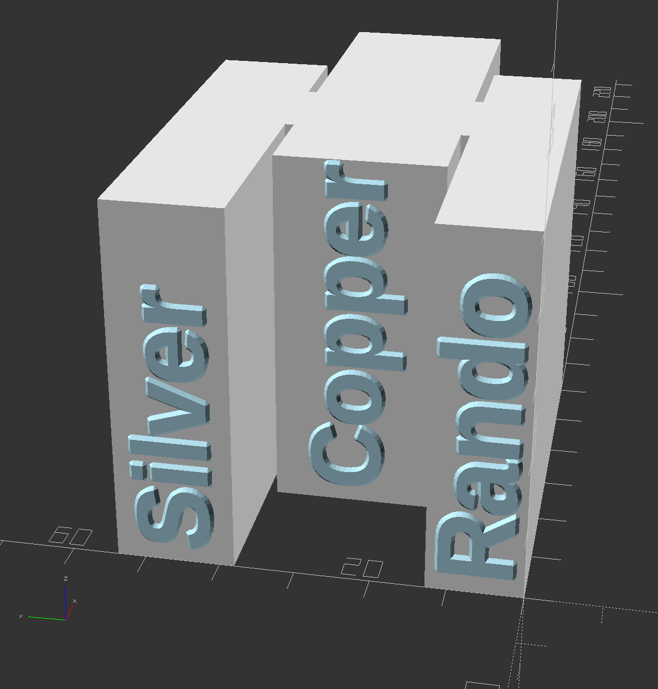
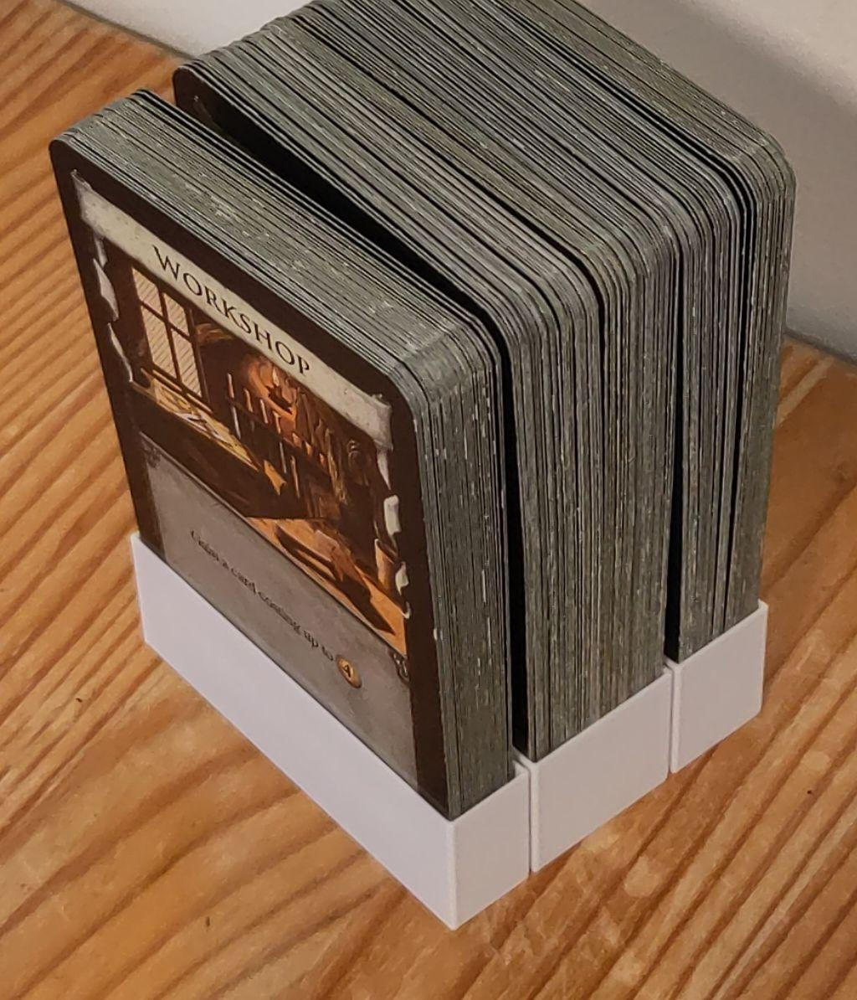
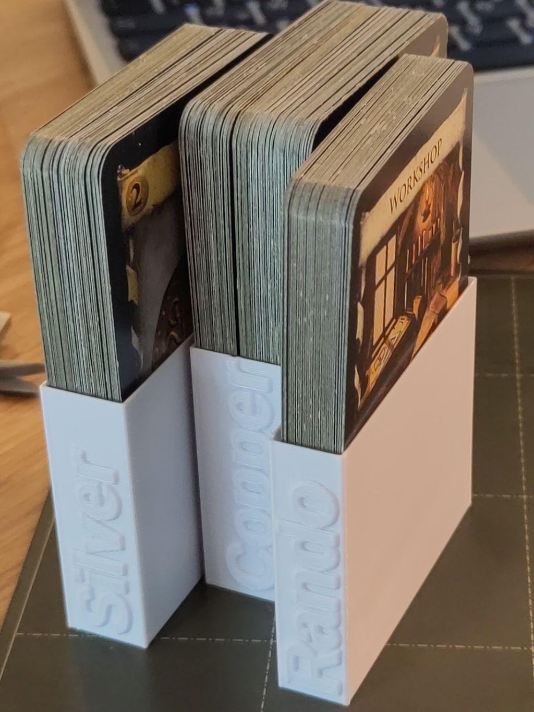

# Card Deck holder, fast print!
This is a card holder thas is meant to be printed in vase mode for fast printing. 

It is parametric, so fill out the parameters for your decks, and run a render in OpenSCAD to get an STL file for printing!

## Pictures!

This is a quick preview of what i have generated for myself, with these settings:
```openscad
deck_sizes = [12,22,15];
deck_names = ["Rando","Copper","Silver"];
wall_thickness = 0.2;
card_stack_offset = 20;
enable_text = true;
card_holder_height = 50;
card_width = 61;
```
|   |   |
|---|---|
||| 

## Parameters explained
The Main parameter you need to fill is the `deck_sizes`, and probably `wall_thickness`. Other parameters are optional as they are set to values that seem to work well with a "standard" card size.

### `deck_sizes`
Unfortunately I could not figure out how to have OpenSCAD allow adding numbers to a list in the paramerts view. So you'll have to edit the code.

Jump to line 2 in card_holder.scad, and add as many sizes as you have decks. 

The size is the thickness of each deck, or stack of cards in millimeters. I found that counting the cards, and multiplying by 0.35 gives a snug fit, and adding an additional 1 results in a slot that the cards easily fit into, but don't jossle arround to much. 

for a deck of 52 cards this is how i would calculate their thickness/size:
```
52*0.35+1= 19.2
``` 
I would probably also round up to 20. 

another example of multiple decks of different sizes:

deck1 is 20mm, deck2 is 15mm, and deck3 is only 6mm. I would set `deck_sizes = [20,15,6];`. 

### `deck_names`
Set this to a list of the names you want printed on the side of each deck. 

Note that if the name extends beyond the height of the deck holder, it will be clipped off. To mitigate this issue, text sizes will not go past a height of 10mm (height of each letter/font size). Text scales down on decks that are thinner, and therefore can be longer.

An example of names of decks: `["Rando","Copper","Silver"]`.

Example of setting the middle of 3 decks to have no label: `deck_names = ["Rando","","Silver"];`

### `wall_thickness`
The "wall thickness" parameter is the size of the walls, so that sould be the printer setting you intend to set on your printer. 

For example i want to use the "0.2mm FAST" setting on my 3D-printer. I would set the second value to `0.2`, so the model will account for the size of the wall when generating the holder. 

### `card_stack_offset`
This is how much each alternating deck is offset from the one before.
if you want all decks to be in a row, set it to `0`.

Here are a cople examples:
|   |   |
|---|---|
|Non staggered (`card_stack_offset = 0`) | Staggered 20mm (`card_stack_offset=20`) |
| |  |

### `enable_text`
This is default set to `false`, but you should set it to `true` before you export the STL. Also save any changes before changing this to `true`. 

It enables a really processor intensive job for beveling the text, but without the beveling the sharp edges of the text would make the slicer of you 3D-printer ignore the text, and only print the box/holder. 

so to reitterate, the last thing you do, after making sure the preview looks good, and saving any changes you made, is to then enable this setting. 

### `card_holder_height`
This is how tall you want the card holder to be. You can initially set it to a low value like `20` to test your setting with a quicker print. then set it back to `50` for your final print. 

### `card_width`
This is only relevant if you have cards that are not standard size, or are planning to stare sleved cards. 
It is for the with of the card, that is; the shorter lenght of the card. 

