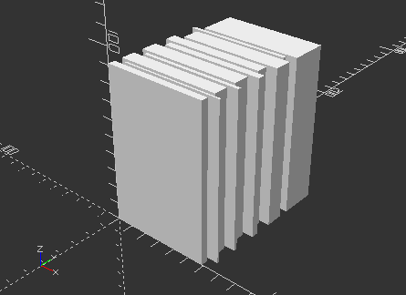

# [WIP] Dominion fast print card holder
This is a card holder thas is meant to be printed in vase mode for fast printing. 

It is parametric, and takes a list of sizes in millimeters for each deck that you want to store in the holder. 
the second parameter is the size of the walls, so that sould be the extruder setting you intend to set on your printer. 
for example i want to use the 0.2mm FAST setting on my 3D-printer, i would set the second value to 0.2, so the model will account for the size of the wall when generating the holder. 

this is a quick preview of what i have generated for myself:

And now theres even a staggered stack of decks!

